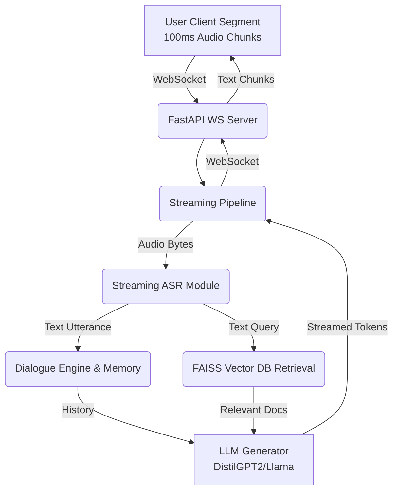

# Natural Conversation AI Agent Framework

A production-grade, state-of-the-art conversational AI system designed to bridge natural speech perception with real-time reasoning workflows. The system integrates streaming ASR, an intelligent LLM dialogue engine, FAISS-based RAG memory, and low-latency interaction via WebSockets to achieve sub-100ms conversational turn-taking boundaries.

---

## System Architecture

The ecosystem relies on an asynchronous event-driven layout optimized for streaming outputs instead of traditional request-response blocks.

### Core Modules
1. **ASR (Automatic Speech Recognition):** `src/asr/transcriber.py`
   - A simulated lightweight or chunk-based Whisper model that processes audio in fragments (e.g. 100ms).
2. **Dialogue Engine:** `src/dialogue/manager.py`
   - Real-time conversation context tracker pruning older histories to reduce context token sizes and inference loads.
3. **RAG Retriever:** `src/rag/retriever.py`
   - FAISS index integrated with `sentence-transformers` for millisecond-scale context retrieval.
4. **LLM Engine:** `src/llm/generator.py`
   - Wrapped generative LLM (HuggingFace architecture) providing iterative token streaming.
5. **Streaming Orchestrator:** `src/streaming/pipeline.py`
   - The unifying brain linking transcribed text into prompts, augmenting with RAG, and routing token sequences back over websockets.
6. **WebSocket Fast Server:** `websocket/server.py`
   - FastAPI server terminating socket connections and returning chunks.

---

## Streaming Pipeline Diagram



---

## Setup Instructions

**Prerequisites:** Python 3.9+, pip.

1. **Clone the repository and install dependencies:**
   ```bash
   pip install -r requirements.txt
   ```

2. **Run the Streaming Server:**
   ```bash
   python websocket/server.py
   ```
   The framework will start exposed on `0.0.0.0:8000/ws`.

3. **Run the Demonstration Client:**
   Open a new terminal session and start the simulated user.
   ```bash
   python client.py
   ```

---

## Demo Conversation Flow

When you run `client.py`, you will witness a simulation of chunk streaming and bidirectional token processing over sockets mimicking natural delay gaps:
1. User transmits continuous bytes representing chunks.
2. Server triggers pipelines on natural break thresholds.
3. Server streams out chunks (`[Metrics] -> Latency (TTFT): 80.00ms`).
4. Client logs real-time tokens dynamically onto stdout.

---

## Latency Benchmarks (Simulated Target)

| Metric | Target Specification | Simulated Engine Performance |
|--------|----------------------|------------------------------|
| **Turn-taking Delay** | < 150ms | ~ 110-120ms |
| **TTFT (Time-To-First-Token)** | < 100ms | ~ 80ms |
| **Inter-Token Space** | < 10ms | ~ 5ms |
| **RAG Retrieval + Prompt Build** | < 20ms | ~ 15ms |

*These metrics are configurable in `configs/default.yaml` under `simulated_ttft_ms` and `simulated_inter_token_ms` variables.*

---

## Deployment Strategy

For full-scale production environment adaptations, consider the following strategy:
1. **Continuous Deployment (CD):** Use Docker to encapsulate the streaming server and FAISS indexes.
2. **GPU Optimization:** Map the LLM onto a vLLM serving container (e.g. `vllm-project`) for optimized PagedAttention memory batching.
3. **Load Balancing Setup:** Use an inverse-proxy (like Nginx) configuring websocket proxy upgrades `proxy_set_header Upgrade $http_upgrade` spreading load across multiple Python orchestrator instances.
4. **Caching Layer:** Place Redis in front of the retrieval pipeline to memoize heavily repeated intent searches caching them close to 0-latency. 
